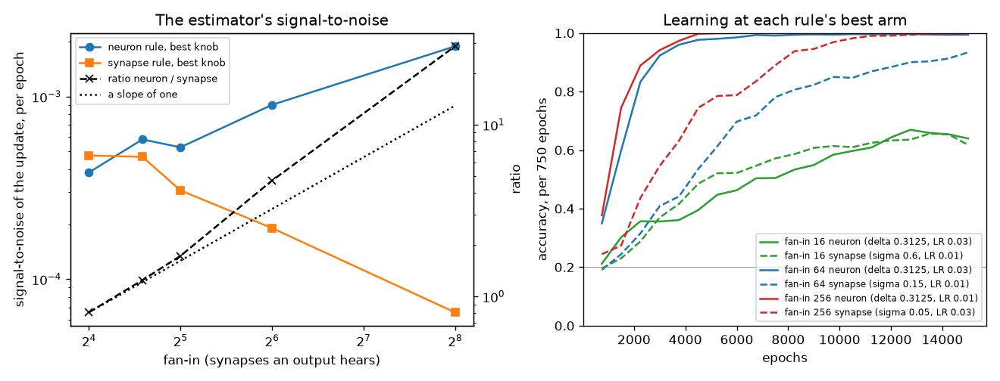
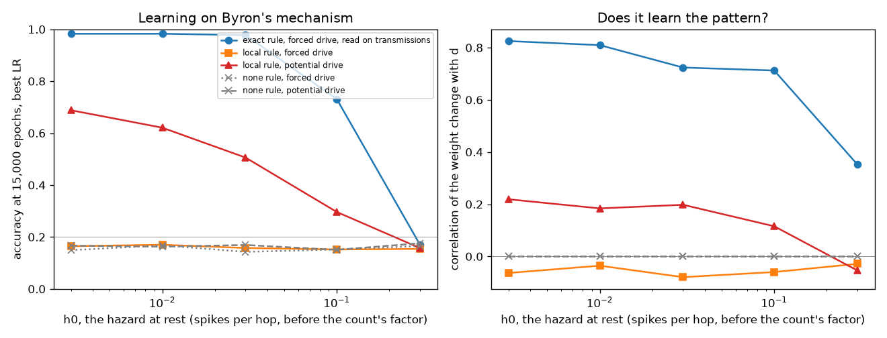

# Escape noise generated by synapses: does it make the reinforce rule local?

September 22, 2026. An investigation of one hypothesis, stated by Byron:

> Escape noise generated by synapses permits local computation of
> reinforcement learning rules.

It is the first question of the direction `AUTHORITY.md` §0.11 names and
issue [#15](https://github.com/byronshock/walnutbutter/issues/15) holds: the
synapse as the learner. Nothing here is a clause; §6 lists the decisions a
clause would need, and §7 records what Byron said to them: a mechanism of his
own for the first, which is not the one this note measured and resets the
rest, his answers to the questions it raised (7.10), and a second toy that
measures his mechanism (7.11). The short answer is **yes, and the price is known**: the
rule becomes exactly local to the synapse, and the estimator it leaves behind
is noisier by about the fan-in, which is the factor Werfel, Xie and Seung
measured between node perturbation and weight perturbation twenty years ago.
§5 measures it on a network shaped like ours and finds the factor in the
estimator's noise and not in the epochs: the local rule learns as fast as the
neuron rule below a fan-in of about twenty — where the September mnist point
runs — and two to four times slower at 64 and 256. An unbiased estimator's
noise does not slow its average progress at a given learning rate; it caps
the rate, and in the toy the cap is a runaway of the dynamics that hits both
rules alike.

## 1. What the hypothesis says, in the file's words

**Today the neuron takes the chance.** At every wave, each neuron draws one
uniform and fires with probability `P_j = 1 - exp(-m_j)`, where the hazard
`m_j` rises as `exp(s_j / Delta_j)` on the neuron's margin `s_j = p_j - theta_j`
(§6.5). The learning rule then posts to **every** synapse into `j`, at every
decision `j` makes,

    e_ij += (c_j - q_j) * x_ij                                    (§8.4)

`c_j` and `q_j` are the decision's credit and expectation — the neuron's
numbers, the same pair for every synapse in the fan-in — and `x_ij` is the
synapse's trace, what it has standing in the potential. So a synapse today
needs three things at every decision of its target: the target's outcome, the
target's hazard (which depends on the target's whole potential, that is, on
every other synapse's delivery), and its own trace. Two of the three are the
neuron's. The note `B_ij` and the running sum `E_j` of §8.11 exist only to
carry those two out to the fan-in without a loop at every decision; §0.11
says as much: "a wave gathers into per-neuron potentials and then broadcasts
the neuron's credit back out".

**The hypothesis moves the chance to the synapse.** If the randomness in the
network is generated by each synapse — in what it delivers — then the object
that explored and the object that is credited are one object, and the rule
that credits it should need nothing but that object's own draw. Byron,
September 17, 2026: "a SYNAPSE explores its own impulse response, rather than
a NEURON exploring its impulse response!"

## 2. Why it is true

Williams's rule (REINFORCE, [1] in `BIBLIOGRAPHY.md`) says: the gradient of
the expected reward with respect to any parameter equals the expectation of
the reward times the derivative of the log-probability of the whole run. The
log-probability of a run is a **sum over every random draw** in it of the
log-probability of that draw's outcome. Differentiating by one synapse's weight
picks out exactly the draws whose probabilities depend on that weight, and
nothing else. So the question "what does the synapse need to know?" has a
mechanical answer: it needs the outcome and the probability of every draw
whose odds its weight shaped.

- **Noise at the neuron.** The draws are the neurons' firing decisions. The
  odds of `j`'s decision depend on `p_j`, and `p_j` depends on every weight
  into `j`, each through its trace. So `w_ij` shapes every decision `j` makes,
  with chain-rule factor `x_ij`, and the entry is `(c_j - q_j) x_ij`: the
  neuron's score, shared across the fan-in, told apart by the trace. This is
  §8.4, and it is node perturbation — Fiete and Seung's rule ([2]) has the same
  shape, the neuron's perturbation times the synapse's activity.

- **Noise at the synapse.** The draws are the synapse's own deliveries. Say an
  arrival along `i -> j` delivers `w_ij + sigma * xi`, `xi` a unit normal drawn
  for that arrival. The odds of that draw depend on `w_ij` and on nothing else
  in the network. The neuron's firing is then a deterministic consequence of
  what was delivered and contains no draw of its own, so no other term in the
  run's log-probability mentions `w_ij`. The entry is the score of the synapse's
  own draw, Williams's Gaussian unit:

      e_ij += xi / sigma          at each arrival integrated, and nothing else.

  No trace, no note, no `E_j`, no `p_hat_j`, no expectation of the neuron at
  all. The synapse posts its own noise, and at the read it is paid
  `LR * A * e_ij` as today. That is the whole rule, and it is exactly local.

Two remarks the derivation gives for free.

**The neuron may keep a hazard of its own and the local rule stays exact.**
If the neuron still fires by a draw on its potential, that draw's odds depend
on the *delivered* values, not on `w_ij` directly, so it still contributes no
term to the synapse's gradient. The synapse-local entry remains an unbiased
estimate of the true gradient with both noises present. The converse holds
too: with both noises present the neuron-level rule of §8.4 is *also* unbiased
(it is the same gradient written in the other set of variables), so the two
are two estimators of one quantity, and any average of them is a third. What
differs is their variance, which is §4.

**But a spike the neuron takes on its own teaches nothing under the local
rule.** A bored spike (§7.2) with no arrivals behind it posts no entry to any
synapse, because no synapse drew anything. Under §8.4 that spike is credited
across the fan-in through the traces. So if the neuron keeps its rest hazard
for exploration, the network can still explore by spontaneous spikes but
cannot learn from them unless the non-local rule is kept beside the local one.

**Seung's version, and where it differs.** The precedent for a synapse
exploring by its own stochastic events is Seung (2003), `references/Seung03.pdf`
(in the folder since September 17; not in `BIBLIOGRAPHY.md`, Byron's call).
His "hedonistic synapse" releases or fails on each presynaptic spike, its
eligibility jumps by `1 - p` on a release and by `-p` on a failure, and it is
paid by a global reward. That is the same score-of-its-own-draw rule for a
Bernoulli draw instead of a Gaussian one. What is learned there is the
**release probability**; the weight is fixed. That matters for us: a release
probability lives in `[0, 1]`, so the expected impulse response `q_ij * w_ij`
keeps the sign it was born with and cannot exceed the weight it was born
with. A rule that learns a signed weight in WEIGHT_RANGE by its own draw needs
the draw to be *on the amount delivered* — the jitter above — not on whether
it is delivered. (A release failure at a fixed probability, with the weight
learned, teaches nothing: the odds of the draw do not depend on the weight, so
its score is zero and the failures are pure noise.) Seung's own discussion
names this alternative: learning "based on fluctuations in quantal size ...
similar to the weight perturbation algorithms".

## 3. Three things "escape noise generated by synapses" could mean

The record already holds two readings side by side
(`docs/rewrite-outline.md`, must-haves on §0.3), and the derivation above
separates three. Only the first is local *and* keeps the integrate-and-fire
neuron of §0.3.

**(a) The source of the noise is synaptic; the neuron's crossing is
deterministic on the noisy sum.** Each arrival is jittered (or fails) at the
synapse; the neuron fires when the sum reaches the threshold (§6.9's
comparison becomes the rule). The neuron then *exhibits* escape noise without
owning any: Plesser and Gerstner (`references/PlesserGerstner00.pdf`) showed
that an integrate-and-fire neuron with noisy input is well described by an
escape hazard that depends on the distance to threshold — a Gaussian or
error-function hazard where §6.5 uses an exponential one. Under this reading
§6.5 was always the abstraction and the synaptic noise is the thing
abstracted. Two consequences:

- *The width is no longer a constant.* Under jitter the noise standing in the
  potential has standard deviation `sigma * sqrt(sum_i x_ij)`: it grows with
  the evidence integrated since the last spike and is reset by the spike. The
  accumulator plus synaptic noise is a random walk with drift toward a
  threshold — the drift-diffusion picture of `references/GoldShadlen07.pdf` —
  and a neuron is as soft as the evidence it has taken in. A per-neuron
  constant `Delta_j` is what §6.4 has instead.
- *A neuron that hears nothing has no width and never fires* except by its
  drive. §7.2's boredom dies and §4.11 must be rewritten. On mnist under ff2
  all 395 inputs hear nothing; today they fire at the hazard's rest, and the
  September 16 finding was that this pollutes the code the outputs receive
  ("a synapse from an off pixel earns eligibility as if its pixel were half
  on", worth +0.093 of estimator correlation when quieted). Synaptic noise
  quiets them for free, and silences any neuron no one talks to, which is the
  stuck-off failure the reports already count.

**(b) Each synapse carries its own escape clock, and the neuron fires when
any of them rings.** This is the record's "fan-in hazard" (§0.3: a neuron of
fan-in `d` taking a hazard spike within a hop with probability `1/d`; §0.4:
`(2d - 1)/(2d^2)` per refractory period). Independent risks add, so the
neuron's hazard is the sum of its synapses' hazards, and §8.4's hazard row
applied to each synapse's *own* hazard and *own* outcome is an exactly local
rule — as long as each synapse's hazard is a function of that synapse alone.
But then the neuron's chance of a spike is `1 - prod_i (1 - P_ij)`, an OR
over its synapses and, for small hazards, a plain sum of them: a neuron whose
odds are the sum of per-synapse odds does not integrate and has no threshold,
which contradicts §0.3 as a standing value. To keep integration each
synapse's hazard would have to read the neuron's margin, and the entry then
needs the neuron's total hazard again: the locality is gone. (b) is local or
integrating, not both.

**(c) Seung's release and failure, with the release probability learned.**
Local, and the precedent, but a probability is what learns, so a synapse
cannot cross zero or exceed its birth weight (§2 above). It also changes what
WEIGHT_RANGE is a prior on.

The rest of this note takes reading (a) with a Gaussian jitter on the amount
delivered, since it is the one that is local, integrates, and learns a signed
weight — and is Byron's phrase read literally: the impulse response of a
synapse is what it delivers, and the synapse explores it.

## 4. The price

Werfel, Xie and Seung (`references/WerfelXieSeung03.pdf`) computed learning
curves for a linear perceptron of `N` inputs and `M` outputs under three
methods. At each method's best learning rate the error falls per sample by a
factor of `1 - 1/N` under the true gradient, `1 - 1/(MN)` under node
perturbation, and `1 - 1/(MN^2)` under weight perturbation. In their words:
"online gradient descent ... is faster by a factor of M than node perturbation,
which in turn is faster by a factor of N than weight perturbation. The
difference in the rate of convergence is the dimensionality of the noise."
At an equal *small* learning rate all three learn at the same average rate;
the stochastic ones differ in the residual noise they leave. So the price is
paid in the largest usable learning rate and the residual, not in the
direction, and it is the fan-in, `N`.

The reason is not mysterious. Every synapse's update is signal plus learning
noise, the noise being the other noise sources' contributions to the same
reward. With one noise source per neuron a synapse's update carries the
noise of `M` sources; with one per synapse, of `MN`. Averaging `MN` samples
instead of `M` is the factor.

What that factor is here:

| network | synapses an output hears | Werfel's factor |
|---|---|---|
| goo 455, scaled wiring (the September mnist point; ~1,394 synapses) | ~23 | ~23 |
| goo 654, scaled wiring (199 hidden) | ~33 | ~33 |
| goo 455, ff2 | 395 | 395 |

The September runs are tuned against exactly this limit: the learning rate
sweeps found 0.0075 too high for the accumulator and are probing below 0.002
now (`docs/mnist-rebaseline-2026-09-21.md`), which is a run at the edge of
its usable rate — the regime in which a factor on that edge is paid in full.

Three things make a spiking network unlike Werfel's perceptron, and they are
why §5 measures rather than quotes:

1. A synapse under (a) explores only when it carries a spike. Its noise
   dimension per epoch is the number of *arrivals*, not of synapses, and on
   mnist most synapses carry nothing in a given epoch.
2. The neuron rule posts an entry at **every wave for every neuron** (§6.8),
   resting neurons included; each such entry is exactly zero-mean (§8.3) and
   still adds its variance. The synapse rule posts only at arrivals.
3. The two are different systems with different reward landscapes, so the
   comparison can only be made at each rule's own best exploration and
   learning rate, which is Werfel's first criterion.

**What locality buys the engine, in the same breath.** §0.11 and issue #15
count the cost of the inversion as "one uniform per synapse per wave rather
than one per neuron". Under reading (a) that is not the count: a synapse draws
when it *delivers*, so the draws an epoch are the arrivals, not the synapses
times the waves. On the goo 455 network the September 19 measurement
(`docs/waves-per-hop-10k.md`) found about 1,508 waves in a 35 ms epoch, 1.45
signals delivered per wave, 0.51 neurons fired per wave, and 455 decisions per
wave — every neuron, touched or not, because a hazard accumulates exposure
while a potential stands still. That is about 686,000 draws and 686,000
decisions an epoch. Under (a) a neuron with no leak can cross its threshold
only at an arrival, so the comparison is made only for the neurons a wave
touched: about 2,200 draws and 2,200 comparisons an epoch, three hundred
times fewer of each. The draw stream that the parallel-scheduler note found
to be the ceiling would stop being one. The cost that remains is the one §4
is about: each of those far fewer draws carries far less information about
any one weight.

## 5. Measured on a network shaped like ours

`docs/synaptic-noise-toy.py`. Not an engine and held to nothing: a scratch
model of the two rules on one network.

**The network.** Two layers, complement-coded: `B` bits give `2B` input
neurons, exactly `B` of them on at each presentation; `K = 5` classes, one
output neuron each, every output hearing every input, so the fan-in is `2B`.
Class prototypes are random bit patterns and each bit flips with probability
0.1 at presentation. An epoch is 20 waves (a wave is one hop; a 50 ms epoch);
each on-input fires 3 times at random waves (the mnist drive gives ~3.5 an
epoch). Outputs are evidence accumulators with the September operating
point's axis — threshold 0.6 and floor -0.2 quoted at fan-in 18 and scaled
by fan-in / 18 (§4.10) — a refractory period of 2 waves, the floor once a
wave on the wave's total (§6.2) clearing the traces (§6.3), an arrival to a
refractory neuron dropped. The critic is mnist's: the log score of the
Boltzmann distribution of the counts at TEMPERATURE 2, a running baseline at
0.05, LR times advantage times score at the end of the epoch, weights clipped
to [-1, 1]. Accuracy is the fraction of epochs whose label strictly out-spikes
every other class.

**The two rules.** *neuron*: §6.5's hazard with `Delta` quoted in units of the
threshold, `kappa = sqrt(60 / N)`, one decision per output per wave, and the
hazard row of §8.4 posted at every decision — `m e^-m / (1 - e^-m)` times the
trace when it fires, `-m` times the trace when it does not. *synapse*: every
arrival delivers `w_ij + sigma * theta_j * xi`, the output fires by the plain
comparison, and the synapse posts `xi` (the `1 / sigma` folded into LR as
§8.7 folds `1 / Delta`). `sigma` is quoted in units of the threshold as
`Delta` is, so the fan-in scaling reaches both.

**Two instruments.**

- *Signal to noise, without learning.* From one starting network, both rules
  accumulate the update they would have made over 4,000 epochs. Per synapse,
  the mean update over epochs is the signal and its variance is the noise;
  summed over the synapses, `SNR = sum(mean^2) / sum(var)` per epoch, with the
  mean's own sampling noise removed. `1 / SNR` is about how many epochs
  one synapse's own update takes to point more signal than noise. It is a
  property of the estimator, per synapse, and it is **not** the price in
  epochs: the reward answers to all the synapses together, the signal adds
  across them and the noise averages out, so learning moves long before any
  one weight's update is reliable (5.3). The *ratio* of the two rules' SNR is
  how much noisier the local estimator is, free of any learning rate. Beside it, the correlation of the accumulated update with the
  supervised direction `d_ij = P(input i on | class j) - P(input i on)`
  (§11.16's instrument) says whether each rule points the right way at all.
- *Learning.* A grid of (exploration, LR) for each rule at fan-ins 16, 64 and
  256, 15,000 epochs, three seeds, each rule ranked at its own best arm.

### 5.1 Both rules point the right way

Every arm of both rules has a positive and rising correlation of its
accumulated update with the supervised direction. The local rule is an
unbiased estimator in practice as well as on paper: it learns the right
weights, from its own draws alone.

### 5.2 The estimator's noise grows with the fan-in

Signal-to-noise of the update per epoch, without learning, 4,000 epochs, five
seeds, each rule at the exploration that gave it the most signal (`Delta` 0.6
for the neuron rule, `sigma` 1.2 for the synapse rule, at every fan-in):

| fan-in | neuron rule | synapse rule | ratio | Werfel's factor, scaled to agree at 16 |
|---|---|---|---|---|
| 16 | 3.8e-4 | 4.8e-4 | **0.8** | 0.8 |
| 24 | 5.8e-4 | 4.7e-4 | **1.2** | 1.2 |
| 32 | 5.3e-4 | 3.1e-4 | **1.7** | 1.6 |
| 64 | 9.0e-4 | 1.9e-4 | **4.7** | 3.2 |
| 256 | 1.9e-3 | 6.6e-5 | **29** | 13 |

The ratio follows the fan-in closely to 64 and climbs faster than it by 256,
and it crosses one near a fan-in of twenty: below that the local rule is *the
better estimator*, because the neuron rule's entries at every wave of every
neuron cost it variance the synapse rule never posts (§4, point 2), and the
synapse rule's noise dimension is the number of arrivals, which at small
fan-in is small. Above it the fan-in wins, as Werfel says it must. The
crossover sits where the September mnist point runs — an output of the
scaled goo 455 hears about 23 synapses and takes about 40 arrivals an epoch,
against the toy's 24 and 36 — but that is the toy's crossover, and whether
the engine's is there too is a measurement, not an inference.

At the exploration each rule actually learns best at (§5.3: `Delta` 0.3125
and `sigma` 0.15 to 0.3) the ratio at fan-in 64 is 6 to 15 rather than 4.7;
the picture is the same.

**The local rule needs a soft neuron.** The synapse rule's signal is
proportional to `sigma` and its noise is not (the `1 / sigma` is folded into
LR), so its signal-to-noise falls as `sigma^2` at small `sigma`: measured at
fan-in 64 against the neuron rule's 6.8e-4 at `Delta` 0.3125:

| `sigma` | 0.03 | 0.05 | 0.075 | 0.15 | 0.3 | 0.6 | 1.2 |
|---|---|---|---|---|---|---|---|
| synapse rule's SNR | below 1e-5 | 1.0e-5 | 1.5e-5 | 4.4e-5 | 1.1e-4 | 1.7e-4 | 1.9e-4 |
| ratio, neuron / synapse | > 70 | 70 | 46 | 15 | 6.0 | 4.1 | 3.5 |

The jitter that learns best, `sigma` 0.15 to 0.3 of the
threshold per arrival, puts a noise of `0.15 * sqrt(96) = 1.5` to 3
thresholds into an output's potential by the end of an epoch — a far softer
neuron than the escape neuron's width of 0.31 thresholds. A synapse-noise neuron as sharp
as today's escape neuron would need `sigma` near 0.03, where 4,000 epochs
cannot measure a signal at all. This is the trade the
local rule makes: it explores by the whole fan-in at once, and it has to
explore hard to be heard.

### 5.3 Learning

Each rule at its own best arm of a grid over exploration and LR (five
learning rates from 0.003 to 0.3, three seeds, 15,000 epochs), ranked by the
accuracy of its last 750 epochs; the epochs to reach 0.5, 0.8 and 0.95 are
read off the seed-mean curve. `docs/synaptic-noise-toy-report.py` prints every
arm, and `runs/synaptic-noise-toy/` holds them.

| fan-in | rule | best arm | accuracy at 15,000 | to 0.5 | to 0.8 | to 0.95 |
|---|---|---|---|---|---|---|
| 16 | neuron | `Delta` 0.3125, LR 0.03 | 0.64 | — | — | — |
| 16 | synapse | `sigma` 0.6, LR 0.01 | 0.62 | — | — | — |
| 64 | neuron | `Delta` 0.3125, LR 0.03 | 0.994 | 1,500 | 2,250 | 3,750 |
| 64 | synapse | `sigma` 0.15, LR 0.01 | 0.93 | 4,500 | 8,250 | — |
| 64 | synapse | `sigma` 0.3, LR 0.03 (the faster arm) | 0.90 | 2,250 | 4,500 | — |
| 256 | neuron | `Delta` 0.6, LR 0.03 | 1.00 | 750 | 1,500 | 1,500 |
| 256 | neuron | `Delta` 0.3125, LR 0.01 (the operating point's width) | 1.00 | 1,500 | 2,250 | 3,750 |
| 256 | synapse | `sigma` 0.05, LR 0.03 | 0.998 | 3,000 | 6,750 | 9,750 |
| 256 | synapse | `sigma` 0.1, LR 0.03 (the faster arm) | 0.995 | 2,250 | 3,750 | 7,500 |

Three readings.

**At fan-in 16 the two rules are the same rule.** Both cap near 0.63 — eight
bits with a tenth of them flipped do not separate five classes better — and
neither is ahead at any epoch, as the signal-to-noise said.

**Above the crossover the local rule is two to four times slower — not
five or twenty-nine times.** At fan-in 64 it reaches 0.8 in 4,500 epochs on
its faster arm against the neuron rule's 2,250, and by 15,000 epochs stands
at 0.93 against 0.99. At fan-in 256 it reaches 0.8 in 3,750 against 1,500 or
2,250, reaches 0.95 in 7,500 against 1,500 or 3,750, and ends at 0.998
against 1.000. The estimator is five and twenty-nine times noisier; the
learning is two to four times slower. Two reasons, both Werfel's, and one
check.

*An unbiased estimator's noise does not slow its average progress.* Each
epoch's update is the gradient plus zero-mean noise; over many epochs the
gradient adds in a straight line and the noise random-walks, growing only as
the square root of the count. At the same learning rate the two rules make
the same average progress whatever their noise — Werfel's second criterion,
"equal average updates". What a noisier estimator loses is the right to a
large learning rate, and in this network the largest usable rate is not set
by the estimator's noise: both rules break between LR 0.03 and 0.1 at fan-in
256 — the neuron rule at 0.1 falls to 0.53 with its outputs going quiet, the
synapse rule to 0.33 — a runaway of the dynamics, the kind the mnist
accumulator showed at the floor of -2.4, and not a divergence of the
estimate. Capped at the same rate, the two learn at nearly the same rate and
differ by the noise the local rule carries, which is the slower early curve.

*The per-synapse yardstick is not the one learning waits on.* `1 / SNR` is
the epochs before one weight's own update is reliable: 26,000 or more for the
synapse rule at fan-in 256. It reached half accuracy in 2,250. The reward
answers to all 1,280 weights at once; their signals add coherently and their
independent noise averages out, so the reward moves while every single
weight's update is still mostly noise.

*It is not the clip doing the containing.* The best arms were rerun with the
fraction of weights on the rails of WEIGHT_RANGE and the spread of the
weights recorded (`rails` and `wstd` in the toy's history;
`runs/synaptic-noise-toy/rails.json`, seed 1):

| arm | on the rails at 15,000 | spread, start to end |
|---|---|---|
| fan-in 256, neuron, `Delta` 0.3125, LR 0.01 | 14% | 0.58 to 0.63 |
| fan-in 256, synapse, `sigma` 0.05, LR 0.03 | 2% | 0.58 to 0.59 |
| fan-in 256, synapse, `sigma` 0.1, LR 0.03 | 2% | 0.58 to 0.63 |
| fan-in 64, neuron, `Delta` 0.3125, LR 0.03 | 3% | 0.57 to 0.66 |
| fan-in 64, synapse, `sigma` 0.15, LR 0.01 | 3% | 0.58 to 0.61 |

The synapse rule's weights stay interior and barely spread: its learning is
a small coherent drift on the random start, and the noise diffuses nothing to
the rails. The neuron rule is the one that pushes weights onto them.

*The cost that does show is the residual.* Late in learning the synapse
rule's steps stay several times to an order of magnitude larger than the
neuron rule's in the sampled epochs: a unit-normal draw per arrival does not
shrink as the network becomes confident, while the hazard's entries vanish at
decisive margins. That is the plateau at 0.998 and 0.93 rather than 1.00 and
0.99, and it is Werfel's residual term. Where the local rule *would* be blown
out is where the noise ceiling on the learning rate falls below the runaway
ceiling. The noise ceiling falls as the fan-in; the toy's runaway ceiling fell
too, from LR 0.1 to 0.03 between fan-in 64 and 256, and the toy never left the
runaway-limited regime. Whether the goo at fan-in 23 or 395 is in it is a
measurement the toy cannot make.

**The right knob is the noise standing in the potential, not the jitter per
arrival.** The jitter that learns best falls with fan-in — `sigma` 0.6 at 16,
0.15 to 0.3 at 64, 0.05 to 0.1 at 256, a sixfold to twelvefold fall for a
sixteenfold fan-in — and what nearly stays put is the noise it leaves in an
output's potential by the end of an epoch: `0.6 sqrt(24) = 2.9`,
`0.15 sqrt(96) = 1.5` to `2.9`, `0.05 sqrt(384) = 1.0` to `2.0` thresholds. A synapse-noise
network wants its exploration quoted as a width of the potential, in
thresholds, with the per-arrival jitter derived from it by the expected
arrivals — the same shape as §6.6's law, and the same reason (§0.7): built
into the rule, not swept per fan-in.

## 6. What a clause would have to decide

If the direction is taken up, the decisions below are the ones a
specification of it cannot avoid. They are Byron's; the order is the order
they bind each other in.

1. **Which draw the synapse makes.** A Gaussian jitter on the amount delivered
   (the reading measured here; the weight is what learns, and can cross zero);
   Seung's release or failure (a probability is what learns; sign and ceiling
   fixed at build); or a clock per synapse (local only as a neuron that does
   not integrate). §2 and §3.
2. **What the neuron's decision becomes.** The plain comparison of §6.9, with
   the escape noise emergent from the fan-in; or the comparison *and* a hazard
   of the neuron's own kept for boredom — in which case §2's remark applies:
   the bored spikes teach nothing unless §8.4 is kept beside the local rule,
   and then two estimators of one gradient run at once.
3. **A neuron that hears nothing.** Under the comparison it never fires but by
   its drive. §7.2 (boredom is a rate) and §4.11 go; the September 16 off-pixel
   finding is answered; a stuck-off neuron has no way back but its inputs.
4. **The knob, and its scaling.** `sigma` replaces ESCAPE_DELTA as the one
   constant that says how much the system explores. Its unit (the threshold,
   as `Delta`'s is) and its law with the count and the fan-in are open: the
   noise standing in a potential grows as the square root of the arrivals
   integrated, so a neuron of large fan-in is softer at a fixed `sigma`, the
   opposite direction to §6.6's `sqrt(60 / N)`. §0.7 asks that the law be built
   into the rule, not swept.
5. **The draw's place in the stream.** One normal per arrival per synapse, in
   delivery order, from the exploration stream — in place of one uniform per
   neuron per wave (§6.7, §7.3). The count of draws an epoch changes from
   `N x waves` to the number of arrivals; §12.6's one-stream-one-order
   invariant governs a different and data-dependent sequence, and the Rust
   loop still has to take Python's generator state and hand it back.
6. **What a synapse holds.** For the rule: its weight and its score. The trace,
   the note and the neuron's `E_j`, `p_hat_j` and decision count leave with the
   broadcast they served (§1.5, §2.1, §8.11, §8.14); the trace stays only if
   something else reads it. An arrival to a refractory neuron still posts
   nothing (§8.13); the floor no longer clears anything, since the entries
   stand whatever the neuron does with the sum.
7. **The learning rate.** `1 / sigma` folded in as `1 / Delta` is today (§8.7),
   and the usable range moved by the fan-in (§4).
8. **The fraction of the price paid.** §4's factor is the ceiling; §5 finds
   nothing to pay in epochs at the fan-in the September point runs at and a
   factor of two to four at 64 and 256, in a toy, with the noise showing as a
   residual rather than a wall. The decision is whether locality — no
   gather, no broadcast, one sparse matrix updated elementwise, which is the
   second half of §0.11, and three hundred times fewer draws and decisions an
   epoch — is worth that many more epochs where it costs any, or whether the
   two estimators are kept side by side and the local one used where the
   sparse form pays for it. The measurement that settles it is the one the
   toy stands in for: the two rules on the goo, which needs the clause first.

## 7. What Byron said to the decisions

The eight drafts below were written by Claude in Byron's voice on September
22, 2026, one per question of §6, with Claude's recommendation filled in as
the default. Byron posted the first to
[PR #22](https://github.com/byronshock/walnutbutter/pull/22#issuecomment-5787749640)
at 20:10 MDT, and at 03:31 MDT on September 23 he edited that comment and set
the draft aside:

> **What follows is not really what I am thinking. What I am thinking is that
> the synapse ESCAPES with probability density monotonically increasing as
> (min(max(V_pre,0),V_threshold)/V_threshold. At V_threshold and greater this
> is equal to 1, so the synapse "fires" deterministically. This does NOT
> necessarily generate an action potential in its effect on V_post.**

That is the mechanism this note should have been measuring, and it is none of
§3's three readings. The drafts stand below as what was proposed and not as
decisions: 7.1 is superseded by Byron's words above, and 7.2 to 7.8 were
written for the jitter of 7.1 and await his word on his own mechanism. An
earlier version of this section, merged the same night, called them "the
decisions, as Byron made them"; that was Claude's error of the record, and
this is its correction. §7.9 is Claude's reading of Byron's mechanism under
the reinforce rule, and the questions it cannot answer alone. Square brackets
in the drafts are the places left open.

**"I want to investigate a hypothesis: "Escape noise generated by synapses permits local computation of reinforcement learning rules."** Byron, 09/22/2026.

### 7.1

**Decision 1 of 8 — which draw the synapse makes.** The synapse jitters the
amount it delivers. An arrival along i → j delivers w_ij + σ_j ξ, with ξ a
unit normal drawn for that arrival, and the weight is what learns. Not
Seung's release-or-failure: a probability cannot cross zero, and WEIGHT_RANGE
is a signed prior. Not a clock per synapse: that is an OR of synapses, and
§0.3 says a neuron integrates. A synapse explores its own impulse response,
literally — the impulse response is what it delivers.

### 7.2

**Decision 2 — what the neuron's decision becomes.** The plain comparison: a
neuron fires when its potential reaches its threshold, §6.9 becomes the rule,
and the neuron owns no hazard. Whatever escape noise it shows is what the
fan-in's jitter makes it (Plesser & Gerstner). I am not keeping a hazard of
the neuron's own beside it: under the local rule a bored spike teaches
nothing, and two estimators running at once is not a mechanism I understand.

[If you want boredom kept, replace the last sentence with: "§6.5 stays at
the rest rate only, and §8.4 stays beside the local rule to pay for it."]

### 7.3

**Decision 3 — a neuron that hears nothing never fires but by its drive.**
§7.2 (boredom is a rate) and §4.11 go. This answers the September 16
finding — an off pixel no longer earns eligibility as if it were half on —
and it makes a stuck-off neuron a fact about the wiring rather than a failure
of a rule: an output that no live input reaches has nothing to learn from.
The reports keep counting stuck-off; the wiring is where the fix lives.

### 7.4

**Decision 4 — the knob is the noise standing in the potential, quoted in
thresholds.** One constant, [SYNAPSE_WIDTH — name it]: the standard
deviation the jitter leaves in a neuron's potential once its fan-in has
spoken once, in units of that neuron's threshold. The per-arrival jitter
follows from it and is not a knob:

    σ_j = SYNAPSE_WIDTH × θ_j / sqrt(d_j),   d_j the fan-in of j.

That is §6.6's shape — the scale built into the rule, not swept per fan-in
(§0.7) — and the toy's best arms sat at one to three thresholds at every
fan-in it ran. The square root of the count (§6.6) is discharged by this:
the knob quotes a neuron's softness, and a bigger network is not a softer
one. Start it at [2]; sweep it once at the September operating point.

[If you would rather keep the √(60/N) law beside it, say so here; the two
compose as a product and the toy did not test that.]

### 7.5

**Decision 5 — the draw.** One normal per arrival integrated, drawn at the
moment of integration, in delivery order within the wave, from the
exploration stream (§7.3) — in place of one uniform per neuron per wave. An
arrival a refractory neuron drops draws nothing. The normal is made from the
stream's uniforms by one named transform in every engine, so §12.6's
one-stream-one-order invariant holds on a sequence the data decides: same
seed, same arrivals, same normals, same spikes. [Claude to propose the
transform — Box–Muller on two uniforms with both outputs used and nothing
cached, or the inverse normal CDF of one uniform — and to show the three
engines agree on it to the bit before it is written.] §7.3's count of the
draws is rewritten: the draws an epoch are the arrivals, some thousands on
the goo, not 686,000.

### 7.6

**Decision 6 — a synapse holds three things.** Its weight, its stamp (the
quash's, §1.7) and its score. The trace, the note, and the neuron's E_j,
p̂_j and decision count leave with the broadcast they served. An arrival a
refractory neuron drops posts nothing (§8.13 stands). The floor clears
nothing any more: an entry stands whatever the neuron does with the sum,
because the floor is part of the path from what was delivered to what was
rewarded, and the score of the draw already accounts for that path.

### 7.7

**Decision 7 — the learning rate.** 1/σ_j is folded into LR as 1/Δ_j is
today (§8.7): the synapse posts ξ and the read pays LR × A × Σ ξ. The usable
range moves and is swept once at the September point beside
[SYNAPSE_WIDTH]; the toy's best rates were within a factor of three of the
neuron rule's.

### 7.8

**Decision 8 — build it as a run's choice beside the rule in force, and
measure it on the goo.** The specification gains where the exploration is
generated as a per-run choice — `neuron` as today, `synapse` as decided
above — in every engine (§0.9), with today's default unchanged until the
measurement is in. The measurement is the toy's, made in the engine: the
goo 455 at the September operating point (fan-in about 23, where the toy's
crossover sits), both rules, 100k epochs, three seeds, ranked on accuracy
with stuck-off shown. If the local rule is not slower there it becomes the
default and §6–§8 are rewritten from §0 down; if it is, the price is known in
the engine and not in a toy. The order of work is the file's: the clauses
are written and tested before the code.

[If you would rather specify it whole and replace §6–§8 outright, say so
here instead; the run's choice is the smaller step, not the only one.]

### 7.9 Byron's mechanism under the reinforce rule — Claude's reading, awaiting his word

**The mechanism, as read.** A neuron fires by the comparison (§6.9) and its
spike is certain: at V_threshold every synapse it has transmits, which is the
action potential. Below threshold, every synapse of the neuron makes its own
escape decision at every wave, with a hazard that rises monotonically with
the source's potential as a fraction of threshold,
`u = clip(V_pre, 0, V_threshold) / V_threshold`, and reaches certainty at
`u = 1`. An escape delivers the synapse's weight to its target a hop later,
and the source's potential is not reset by it. The exploration is therefore
subthreshold transmission: a neuron near its threshold leaks through its
synapses, one at a time and at random, and a neuron at threshold fires them
all.

**Who the rule credits.** Williams's rule credits whatever parameter shaped a
draw's odds (§2). The odds of the escape of the synapse `i -> j` depend on
`V_pre`, the potential of its source `i`, and `V_pre` is built by the synapses
*into* `i`, each through its trace. So the score of an escape of `i -> j` is
posted to every synapse `k -> i`, as `(c - q)` times `x_ki` — the hazard row
of §8.4 with the decision being the synapse's rather than the neuron's, and a
neuron of fan-out `F` making `F` decisions a wave instead of one. The weight
`w_ij` of the synapse that escaped shapes no odds of its own: it is credited,
as today, by what it had standing in its *target's* potential when the
target's synapses took their chances. The exploring object and the credited
object are neighbours, one hop apart, and not the same object, and the rule
keeps §8.11's shape — a neuron's running sum, broadcast to its fan-in by the
note — with the draws multiplied: every synapse a wave rather than every
neuron, about 1,394 against 455 on goo 455.

**Unless V_threshold is the synapse's own.** If the threshold in Byron's
expression belongs to the synapse — so that a synapse fires with certainty at
its own level, which may sit below the neuron's, and "does not necessarily
generate an action potential" is exactly that — then the synapse has a
parameter that shapes its own draw, and the score of its escape credits that
parameter from its own outcome and its own expectation and nothing else:
exactly local, Seung's hedonistic synapse with the source's potential as the
driver. What such a synapse learns is *when* to transmit as a function of its
source's subthreshold potential — its transfer function, which is an impulse
response in Byron's sense. What it delivers, `w_ij`, stays a weight learned by
the non-local rule or fixed, with Seung's limit (§2): the sign of a synapse is
the sign of its weight, and no threshold can change it.

*Closed by Byron's first answer (7.10): V_threshold is the neuron's, a
universal constant of the system, so the local case does not arise and the
rule is the one of the paragraph before.*

**A local rule on this mechanism that is not the gradient.** Seung's rules R1
and R2 can be laid on the weight instead of on a release probability: a
speculative transmission followed by reward strengthens the synapse, a
failure followed by reward weakens it — `(y - P) * A * sign(w_ij)` from the
synapse's own outcome and expectation, nothing of the neuron. It is not
Williams's estimator here, because the weight does not shape the draw; it
estimates the reward's sensitivity to a delivery along the synapse at the
moments the synapse speculated, and assumes that sensitivity is the same at
the moments the neuron fired. Its expected step is proportional to the
weight's own size, so a weight near zero learns nothing from its escapes — a
transmission of nothing tests nothing — and no weight can cross zero by it.
That is Seung's limit in another form: a synapse's own events can teach it
how much of what it delivers to deliver, never the opposite of it. Whether
such a rule is worth carrying beside the exact one is a measurement, not a
derivation, and the toy can make it once it runs Byron's mechanism.

**What follows either way.** The neuron's spike is deterministic and §6.9 is
the rule; the draws a wave are one per synapse whose source is below
threshold; a silent neuron's synapses escape at the hazard's value at
`u = 0`, so whether the September 16 off-pixel finding is answered depends on
that value being zero; and the trace, the note and the running sum stay,
because the credit still crosses from a decision to a fan-in. §5's
measurement does not apply to this mechanism: the toy's synapse rule jittered
what was delivered, and this jitters when.

**The questions only Byron can answer** — answered in 7.10.

1. Is V_threshold the neuron's threshold or the synapse's own? Locality turns
   on it.
2. What does an escape do to V_pre — nothing, or does it take something out?
3. What is the hazard at V_pre = 0: zero, or a rest rate?
4. Does the neuron keep its threshold and its deterministic spike, or is θ
   deprecated (§0.12) — and then what resets the potential?

### 7.10 Byron's answers, September 23, 2026

Byron, September 23, 2026, about 03:45 MDT, to the four questions of 7.9,
verbatim:

> 1. V_threshold is a universal constant of the system. This already exists
> as the firing threshold voltage of a neuron. The synapse will still fire
> deterministically when the presynaptic (soma) voltage exceeds V_threshold,
> but may fire speculatively in advance of the presynaptic neuron's action
> potential.
> 2. Given that there are ~100000 presynaptic terminals, I don't think we need
> to account for the voltage drop at the soma (which would not be
> instantaneous anyway) for each synapse.
> 3. To be determined through rigorous investigation.
> 4. The neuron keeps its threshold and its deterministic spike.
>
> One thing I should note right now while it occurs to me is that this may
> not agree with the literature. In the literature escape noise at the soma is
> most often noticed during a neuron's rest period, not when it is close to
> saturation. However, close to saturation, it would be less noticeable
> according to the formulation above.

**What is settled by them.** The threshold is the neuron's, so the exact
reinforce rule on this mechanism is the non-local one of 7.9: a synapse's
speculative transmission is scored to the synapses into its source, through
their traces, and a synapse's own weight is scored by its target's
transmissions, as today. Every synapse whose source is below threshold makes
a decision every wave, all of a neuron's synapses at the same hazard, so the
wave's entry to a neuron's fan-in is what the neuron counted — its
speculative transmissions this wave against the number it expected, each
transmission credited by the hazard row of §8.4 — times each incoming
synapse's trace, and the note carries it as §8.11 does. A speculative
transmission leaves the source's potential where it was; the neuron keeps
its threshold and its deterministic spike, so §0.12's deprecation of θ is
off and §6.9 becomes the rule in force. The hypothesis, in §0.11's sense of
the exploring object being the credited object, is not borne out by this
mechanism; what the mechanism does is move the randomness to the synapse and
make an exploration event one transmission rather than one spike.

**What is open.** The hazard at rest, `h(0)`, to be measured: it sets whether
a silent neuron's synapses whisper (the off-pixel finding of September 16)
and whether the network has spontaneous activity at all. The draw's transform
and order. The scaling of the hazard with the fan-in or the count (the
record's `1/d` per hop, §0.3). And whether the local approximation of 7.9 is
carried beside the exact rule.

**On the literature, Claude's reading.** The escape noise of the literature
(Plesser and Gerstner, `references/PlesserGerstner00.pdf`) is a spike of the
whole neuron at a hazard that rises with the potential, and it is the
soma-side abstraction of the diffusive noise of many small synaptic inputs.
Byron's mechanism puts the noise back on the synaptic side and one hop
upstream: a neuron of fan-out `F` transmits speculatively at `F` times the
per-synapse hazard, each event delivering one weight rather than all `F` at
once, and none of them resetting the neuron. With the per-synapse hazard
equal to the literature's neuron hazard, what a target receives has the same
mean and a smaller variance — the same drift, spread over many small
independent steps — which is why, near threshold, the speculation is "less
noticeable": it is a trickle ahead of a spike that was coming anyway. At rest
the two differ in kind. The literature's rest-period noise is a rare whole
spike that resets its neuron; here it is a tonic leak through the synapses at
`h(0)` that resets nothing, and a spontaneous spike at rest arises only
downstream, where leakage from many sources accumulates in a neuron with no
leak of its own until its deterministic threshold is crossed. So the
mechanism agrees with the literature on the mean, differs on the granularity
and the reset, and puts the whole of the rest-period question into `h(0)` —
which is Byron's third answer.

### 7.11 The second toy: Byron's mechanism, measured

`docs/synaptic-noise-toy2.py`, September 23, 2026, on Byron's "make, build,
and run toys"; `docs/synaptic-noise-toy2-report.py` prints every arm and draws
the figure, and `runs/synaptic-noise-toy/toy2_*.json` holds the arms.

**The model.** The first toy's network — 32 bits complement-coded into 64
inputs, five classes with one output each, every output hearing every input,
accumulator outputs on the September axis with the floor and a two-wave
refractory period, mnist's critic and baseline, 20 waves an epoch — with the
inputs now neurons whose potentials their synapses read. Every synapse of a
source that is awake and below threshold decides every wave, with hazard
`h(u) = h0^(1 - u)` spikes per hop times `sqrt(60 / N)`, `u` the source's
potential as a fraction of its threshold clipped to `[0, 1]`: `h0` is the
hazard at rest and the sweep's variable, and at threshold the source spikes
for certain and every synapse it has transmits. A speculative transmission
delivers the weight and leaves the source alone. Two drives: **forced**, the
file's — an on-input is forced to spike three times an epoch, resets, and
sits at zero between, so every input's synapses whisper at `h0` whether the
input is on or off; and **potential** — an on-input is charged by nine
deliveries of a third of its threshold, spikes about three times, and sits
between at a potential its synapses can read. Three rules: **local**, Seung's
R1 and R2 on the weight, `(escaped - P) * sign(w)` at every decision from
the synapse alone; **exact**, Williams's rule, which credits a synapse by the
escapes of its target's outgoing synapses; and **none**. Five rest hazards,
four learning rates, three seeds, 15,000 epochs; each arm below is the best
learning rate for its rest hazard.

**What the mechanism does by itself** — the no-learning control: whispers an
epoch per synapse, from an on-input and from an off-input.

| `h0` | forced: on / off | potential: on / off | output spikes an epoch, forced |
|---|---|---|---|
| 0.3 | 3.65 / 4.89 | 5.53 / 4.89 | 12.6 |
| 0.1 | 1.33 / 1.78 | 3.31 / 1.78 | 9.8 |
| 0.03 | 0.41 / 0.56 | 1.95 / 0.56 | 7.7 |
| 0.01 | 0.14 / 0.19 | 1.24 / 0.19 | 6.8 |
| 0.003 | 0.04 / 0.06 | 0.78 / 0.06 | 6.4 |

Under the forced drive an off-input's synapses whisper *more* than an
on-input's, by the waves the on-input spends refractory: the whisper carries
no pattern. Under the potential drive the on-input's whisper is 1.1 times the
off-input's at `h0` = 0.3 and 13 times at 0.003: the smaller the rest hazard,
the more of the pattern the whisper carries.

**The exact rule posts nothing in two layers.** An output projects nowhere,
so no draw's odds depend on any weight into it, and Williams's estimator is
identically zero: on a network of inputs onto outputs — the mnist goo with no
hidden neurons — Byron's mechanism with the exact rule does not learn, by
construction rather than by measurement. The estimator is nonzero for a
synapse whose target transmits onward: in the scaled goo, the hidden neurons'
incoming synapses, and the outputs' incoming synapses only through the
outputs' projections back onto hidden neurons.

**With the read counting the outputs' transmissions, the exact rule learns.**
Each output given one outgoing synapse to a read neuron that counts whatever
it receives, spikes and speculation alike, so that the output's escapes reach
the reward:

| `h0` | accuracy at 15,000 | corr with `d` | to 0.8 |
|---|---|---|---|
| 0.3 | 0.17 | +0.35 | — |
| 0.1 | 0.73 | +0.71 | — |
| 0.03 | 0.977 | +0.72 | 5,250 |
| 0.01 | 0.983 | +0.81 | 4,500 |
| 0.003 | 0.983 | +0.83 | 5,250 |

Today's rule on the same network reaches 0.8 in 2,250 epochs and 0.994 at
15,000 (§5.3). At `h0` = 0.3 the whispers swamp the outputs, which fire once
an epoch, and nothing is learned.

**The local rule learns nothing under the file's drive, and part of the task
under a charged one.**

| `h0` | forced: accuracy, corr | potential: accuracy, corr |
|---|---|---|
| 0.3 | 0.15, -0.03 | 0.16, -0.05 |
| 0.1 | 0.15, -0.06 | 0.30, +0.12 |
| 0.03 | 0.16, -0.08 | 0.51, +0.20 |
| 0.01 | 0.17, -0.04 | 0.62, +0.18 |
| 0.003 | 0.16, -0.06 | 0.69, +0.22 |

Chance is about 0.15 here, a tie not being a win. Under the forced drive
every arm of twenty is at chance with a correlation at or below zero: the
whispers being pattern-blind, a synapse's own events tell it only whether its
output wanted more or less excitation in general, which is no pattern. Under
the potential drive the rule climbs as the rest hazard falls and the whisper
carries more of the pattern, to 0.69 at `h0` = 0.003 — and no arm reaches 0.8
in 15,000 epochs, against 0.98 for the exact rule and 0.99 for today's.

**Three readings.**

*The rest hazard wants to be small.* Every arm that learned did best at the
smallest rest hazards swept, 0.003 to 0.01 spikes per hop before the count's
factor — an order of magnitude below today's `e^(-1/Delta)` = 0.04 at `Delta`
0.3125. Whether zero is better still is the next sweep; under the forced drive
zero would mean no speculation from any input at all, and so nothing for a
two-layer network to explore with.

*Under the file's drive the local rule has nothing to learn from.* A forced
input sits at zero between its spikes, so its synapses speculate exactly as
an off-input's do. The one local rule this mechanism admits is therefore
blind to the pattern on the mnist goo as it is driven today, and would need
the drive to charge an input rather than force it.

*The exact rule is non-local and needs the speculation to reach the reward.*
Where it does, it learns at about half today's speed; where it does not —
the last layer of any feedforward network, and the mnist goo without hidden
neurons — it is zero.

**For the hypothesis.** On Byron's mechanism as answered in 7.10, escape
noise generated at the synapse does not give a local reinforcement rule that
learns: the local rule available is not a gradient, is pattern-blind under
the file's drive, and reaches 0.69 where the non-local rules reach 0.98 and
0.99; the exact rule is the neuron rule's shape one hop over, and is silent
wherever a neuron's transmissions do not reach the reward. What would give a
local rule is a parameter of the synapse's own in its hazard — Seung's
release probability, or a threshold of the synapse's own — which the first
answer of 7.10 rules out. The toy is a toy: the goo can be measured once a
clause says how an input is driven.

## 8. Sources

All in `references/` already; none fetched for this note.

- Williams (1992), `Williams92.pdf` — REINFORCE; the Gaussian unit whose score
  is `(y - mu) / sigma^2` is §2's rule.
- Seung (2003), `Seung03.pdf` — the hedonistic synapse: reinforcement of
  stochastic synaptic transmission, the eligibility `1 - p` on release and
  `-p` on failure; the release probability as the learned parameter; the
  remark that quantal-size fluctuations would give weight perturbation.
- Werfel, Xie and Seung (2003), `WerfelXieSeung03.pdf` — node against weight
  perturbation: a factor of the fan-in in the best learning rate, equal
  average rates at small ones.
- Fiete and Seung (2006), `FieteSeung06-arxiv.pdf` — perturbation of the
  neuron's conductance credited to synapses by the perturbation times the
  synapse's activity: the shape of §8.4, and the precedent for the rule as it
  stands.
- Plesser and Gerstner (2000), `PlesserGerstner00.pdf` — an integrate-and-fire
  neuron with noisy input is well described by escape noise with a hazard on
  the distance to threshold: why (a) in §3 still shows escape noise.
- Gold and Shadlen (2007), `GoldShadlen07.pdf` — the drift-diffusion picture
  the accumulator with synaptic noise becomes.
